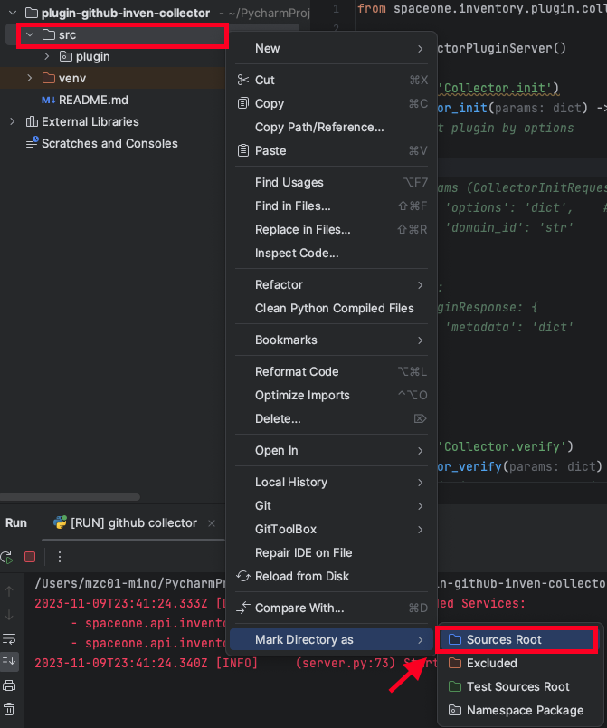
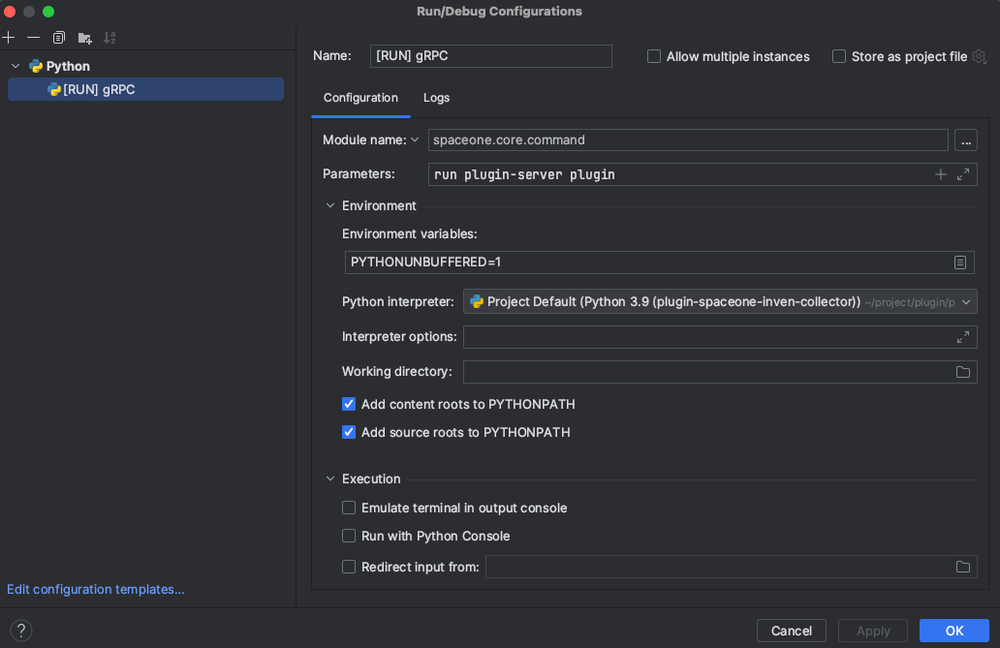
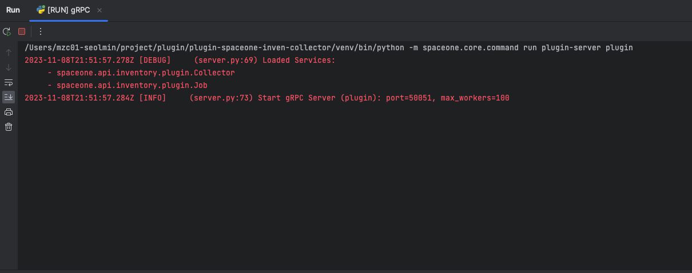

# plugin-spaceone-inven-collector

## 소개
`plugin-spaceone-inven-collector`는 SpaceONE의 Inventory Collector Plugin으로서  
SpaceONE의 Design 팀의 멤버 정보를 수집하는 Collector입니다.    
해당 플러그인은 새로운 플러그인 프레임워크로 제작 되었습니다.

## 환경 설정과 플러그인 서버 띄우기
현재 spaceone-inventory 패키지가 pre-release 상태이기 때문에, 다음의 순서로 패키지를 설정합니다.

1) 가상 환경 설정  
venv 라이브러리를 활용해 가상 환경을 설정합니다.
```bash
python3 -m venv venv
```
```bash
source venv/bin/activate
```

2) 패키지 설치  
생성한 가상 환경에 다음의 명령어로 패키지를 설치합니다.
```bash
pip3 install -r pkg/pip_requirements.txt
```
```angular2html
pip3 install --pre spaceone-inventory
```

3) interpreter 설정  
    Pycharm을 사용하는 경우, 해당 가상 환경을 interpreter로 설정합니다.  




위 순서로 진행한 후 `RUN`할 경우 `Plugin Server`가 실행됩니다.  



## Local 환경 테스트
`Plugin Server`를 실행한 후, 다음의 명령어로 **메서드별 테스트**를 진행합니다.

<br>
<br>

`사용할 수 있는 API 메서드 확인`
```bash
spacectl api-resources
```

<br>

1) `Collector.init`
```bash
spacectl exec init inventory.Collector -f test/init.yml
```

<br>

2) `Collector.verify`
```bash
spacectl exec verify inventory.Collector -f test/verify.yml
```

<br>

3) `Collector.collect`
```bash
spacectl exec collect inventory.Collector -f test/collect.yml
```


## 참고 사항
* metadata는 dict타입으로 정의하는 것을 yaml로 변환할 예정입니다.
* spaceone-inventory 패키지는 pre-release 상태이기 때문에, pip install시 `--pre` 옵션을 추가해야 합니다.
